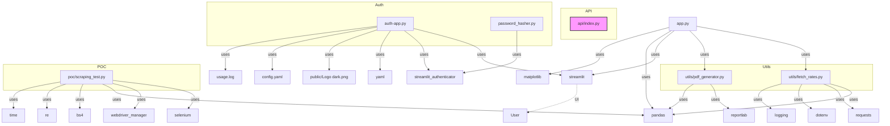

# Project Structure Visualization (Mermaid)

---

**Legend:**
- Main app: `app.py`
- Utility modules: `utils/`
- Auth modules: `auth-app.py`, `password_hasher.py`
- API: `api/index.py`
- Proof of concept: `poc/scraping_test.py`
- Arrows show dependency/import relationships.
- External dependencies and resources are shown as leaf nodes.

> Copy this Mermaid block into any Mermaid-compatible viewer (e.g. VSCode extension, Mermaid Live Editor, GitHub) to view the interactive graph.
